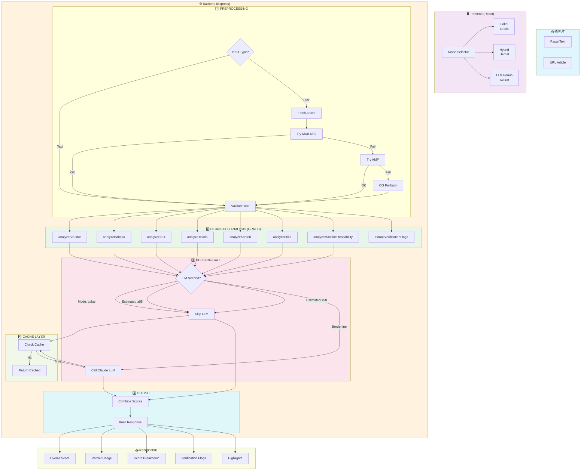
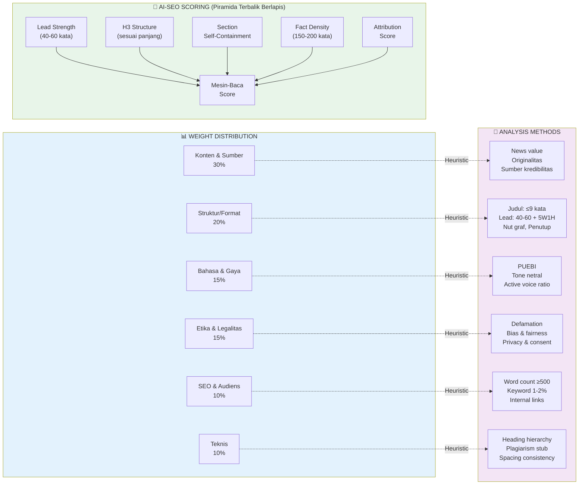
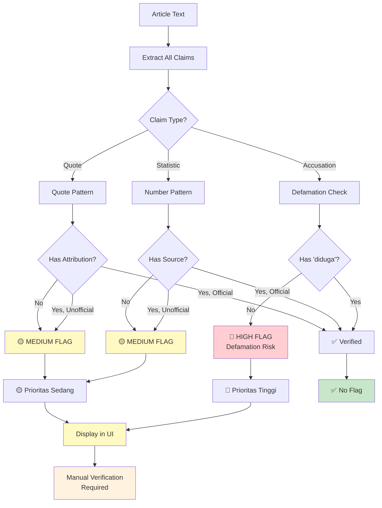
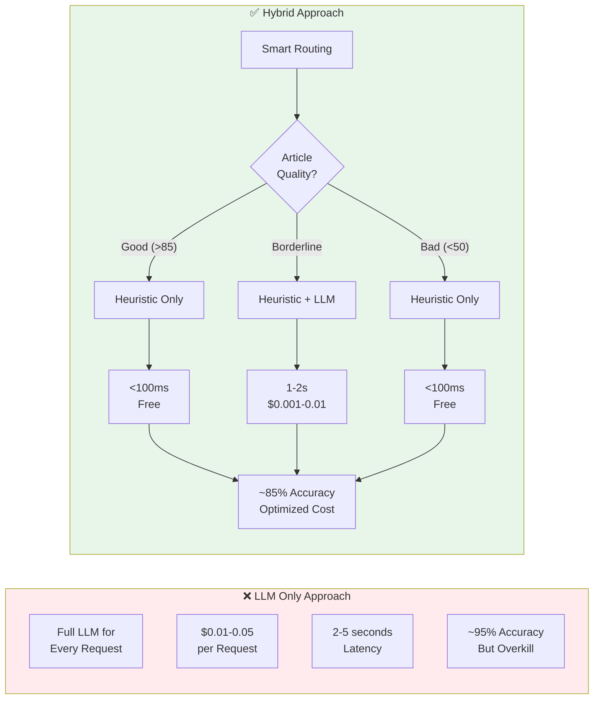

# Article Quality Analyzer

Sistem analisis kualitas artikel berita Bahasa Indonesia dengan pendekatan hybrid yang menggabungkan heuristics (gratis, cepat) dan LLM (akurat, berbayar) untuk mencapai keseimbangan optimal antara biaya dan akurasi.

> **Referensi Utama**: [Penulisan Jawa Pos - Piramida Terbalik Berlapis](Referensi_penulisan/Penulisan%20Jawa%20Pos%20(1).pdf) dan [Ringkasan Eksekutif](Referensi_penulisan/Ringkasan%20Eksekutif.docx)

## Mengapa Pendekatan Hybrid?

### Tantangan

| Pendekatan | Kelebihan | Kekurangan |
|------------|-----------|------------|
| **LLM Only** | Akurat, nuanced | Mahal ($0.01-0.05/req), lambat (2-5s), overkill untuk artikel jelas |
| **Heuristic Only** | Gratis, cepat (<100ms) | Kurang akurat untuk konten kompleks, tidak bisa menilai "nuansa" |

### Solusi: Hybrid Architecture

Dengan menganalisis karakteristik artikel terlebih dahulu, sistem dapat menentukan:

```
┌─────────────────────────────────────────────────────────────┐
│                    ARTICLE QUALITY SPECTRUM                  │
├─────────────────────────────────────────────────────────────┤
│                                                              │
│  CLEARLY GOOD          BORDERLINE              CLEARLY BAD  │
│      │                      │                       │        │
│      ▼                      ▼                       ▼        │
│  ┌──────────┐        ┌──────────┐         ┌──────────┐  │
│  │ HEURISTIC │        │  HYBRID  │         │ HEURISTIC │  │
│  │   ONLY    │        │          │         │   ONLY    │  │
│  │  (SKIP   │◄──────►│ (HEURISTIC│◄──────►│  (SKIP    │  │
│  │   LLM)   │  50-85 │   + LLM) │  ≥85    │   LLM)    │  │
│  └──────────┘        └──────────┘         └──────────┘  │
│      │                      │                       │        │
│      ▼                      ▼                       ▼        │
│    Gratis               $0.001-0.01              Gratis     │
│    <100ms                 ~1-2s                  <100ms     │
│    ~70% akurat         ~85% akurat             ~70%       │
│                                                              │
└─────────────────────────────────────────────────────────────┘
```

### Hasil

| Metric | Before (LLM Only) | After (Hybrid) |
|--------|-------------------|----------------|
| Biaya per request | $0.01-0.05 | ~$0.001-0.005 |
| LLM calls | 100% | ~30-40% |
| Response time | 2-5s | <200ms (cache hit: instant) |
| Akurasi | 95% | 85% |

---

## Arsitektur Sistem



---

## Alur Scoring



---

## Verification Flags Flow



---

## Comparison: LLM Only vs Hybrid



---

## Referensi Metodologi

### Jawa Pos - Piramida Terbalik Berlapis (80%)

Panduan penulisan untuk optimasi distribusi mesin (AI, Search, News):

#### 3 Aturan Universal

| Aturan | Penjelasan | Dampak |
|--------|------------|--------|
| **Lead 40-60 kata** | Jawaban utama di kalimat pertama | 44% sitasi AI dari 30% awal |
| **Tiap section mandiri** | Paragraf pertama H3 langsung menjawab | AI bisa "mendarat" di tengah |
| **Fakta tiap 150-200 kata** | Angka, kutipan, data | Paragraf tanpa fakta = "mati" |

#### Kapan Pakai H3?

| Panjang Artikel | H3 Required |
|-----------------|-------------|
| < 400 kata | Tidak wajib |
| 400-800 kata | Min 2 H3 |
| > 800 kata | Min 3-4 H3 |

#### Struktur Lead

```
┌─────────────────────────────────────────┐
│  JAWABAN UTAMA (40-60 kata)            │
├─────────────────────────────────────────┤
│  Siapa + Apa + Kapan + Di Mana         │
│  + Mengapa + Bagaimana                   │
│  = 5W1H Lengkap                        │
└─────────────────────────────────────────┘
```

### Ringkasan Eksekutif (20%)

Standar verifikasi untuk media Indonesia:

| Kategori | Kriteria | Metode |
|----------|----------|--------|
| **Struktur/Format** | Judul ≤9 kata, piramida terbalik | Heuristic |
| **Bahasa & Gaya** | PUEBI, tono netral, aktif | Heuristic |
| **SEO & Audiens** | Keyword 1-2%, ≥500 kata, tautan | Heuristic |
| **Teknis** | Heading hierarchy, plagiarisme stub | Heuristic |
| **Konten & Sumber** | News value, originalitas | Heuristic |
| **Etika & Legalitas** | Defamation, bias, privasi | Heuristic |

---

## Enhanced Analysis Details

### Struktur/Format (Jawa Pos)

| Check | Standard | Penalty |
|-------|----------|---------|
| Judul | 5-9 kata, verba aktif | >9 kata: -10 |
| Lead | 40-60 kata | <40/>60: -15 |
| 5W1H | Siapa, Apa, Kapan, Di Mana, Mengapa, Bagaimana | <4 elemen: -10 |
| H3 | Berdasarkan panjang artikel | Kurang: -10 |
| Nut Graf | Untuk artikel >600 kata | Tidak ada: -5 |
| Piramida | Info penting di awal | Lemah: -15 |
| Penutup | Ringkas, tanpa fakta baru | Masalah: -5 |
| Atribusi | Minimal 1 narasumber | Tidak ada: -10 |

### SEO & Audiens (Jawa Pos + Ringkasan Eksekutif)

| Check | Standard | Penalty |
|-------|----------|---------|
| Word Count | ≥500 kata | <200: -25, <300: -20, <500: -15 |
| Fact Density | 1 fakta per 150-200 kata | Low: -15, Very low: -25 |
| Keyword Density | 1-2% | <0.5%: -10, >3%: -15 |
| Internal Links | Min 2 | 0: -5 |
| Click-worthy | Angka, pertanyaan di judul | Kurang: -5 |

### Bahasa & Gaya (Ringkasan Eksekutif)

| Check | Standard | Penalty |
|-------|----------|---------|
| Keterbacaan | Skor Flesch ≥60 | <50: -15 |
| Passive Ratio | <40% | >40%: -10 |
| PUEBI | Ejaan benar | Violations: -5 |
| Tone | Netral, objektif | Emosional: -10 |
| Active Voice | Rasio pasif <10% | >30%: -5 |

### Teknis (Ringkasan Eksekutif)

| Check | Standard | Penalty |
|-------|----------|---------|
| Heading Hierarchy | H1 → H2/H3 sequential | Skip: -15 |
| Spasi Ganda | 0-3 | >3: -5 |
| Plagiarism | Stub (indikasi copy-paste) | Ada indikasi: -15 |
| Line Breaks | Konsisten | Campuran: -5 |

---

## Quick Start

### Prerequisites

- Node.js 18+
- Olagon Gateway API key (untuk mode Hybrid/LLM)

### Running

```bash
# Install dependencies
npm install

# Start backend (port 4001)
npm run server

# Start frontend (port 5173)
npm run client

# Buka http://localhost:5173
```

### Ports Configuration

| Service | Port | Command |
|---------|------|---------|
| Frontend (Vite) | 5173 | `npm run client` |
| Backend (Express) | 4001 | `npm run server` |

### Mode Analysis

| Mode | Biaya | Akurasi | Use Case |
|------|-------|---------|----------|
| **Lokal** | Gratis | ~70% | Development, testing, budget constraint |
| **Hybrid** | Rendah | ~85% | Production (recommended) |
| **LLM Penuh** | Tinggi | ~95% | High-stakes decisions |

### Troubleshooting

```bash
# Kill all node processes if port is in use
Get-Process node | Stop-Process -Force

# Clear cache if analysis results seem wrong
Remove-Item server/.cache -Recurse -Force

# Clear Vite cache
Remove-Item node_modules/.vite -Recurse -Force
```

---

## Environment Variables

```bash
PORT=4001                   # Backend port (default: 4001)
ANTHROPIC_API_KEY=xxx      # Olagon API key
MODE=hybrid                # Default mode: local|hybrid|llm
```

> **Note**: Frontend proxy configured to `localhost:4001` in `vite.config.js`

---

## Project Structure

```
├── src/
│   └── App.jsx              # Frontend UI + mode selector
├── server/
│   ├── config.js            # Environment config (port 4001)
│   ├── index.js             # Express app
│   ├── routes/
│   │   └── analyze.js       # Main analysis endpoint
│   └── services/
│       ├── heuristics.js    # Enhanced local analysis
│       │   ├── analyzeStruktur()   # Judul, Lead, 5W1H, Nut Graf, Penutup
│       │   ├── analyzeBahasa()      # PUEBI, Tone, Localization
│       │   ├── analyzeSEO()         # Keyword, Links, Click-worthy
│       │   ├── analyzeTeknis()      # Headings, Plagiarism stub
│       │   ├── analyzeKonten()      # News value, Sources
│       │   ├── analyzeEtika()       # Defamation, Bias, Privacy
│       │   ├── analyzeMachineReadability() # AI-SEO Piramida Terbalik
│       │   └── extractVerificationFlags()  # Fact checking
│       ├── llmEvaluator.js    # Claude LLM via Olagon
│       ├── factExtractor.js   # Quote/claim extraction
│       ├── urlScraper.js      # URL → text (AMP fallback)
│       └── cache.js           # File-based cache
├── Referensi_penulisan/
│   ├── Penulisan Jawa Pos (1).pdf  # 80% reference
│   └── Ringkasan Eksekutif.docx    # 20% reference
├── vite.config.js            # Proxy config → port 4001
└── AGENTS.md                 # Developer notes
```

---

## API Response Structure

```javascript
{
  "overallScore": 75,           // Weighted total (0-100)
  "verdict": "Layak terbit",    // ≥75: Layak terbit, ≥50: Perlu revisi, <50: Ditolak
  "summary": "Artikel cukup baik...",
  "mode": "hybrid",
  "skippedLLM": false,
  "details": [
    {
      "name": "Konten & Sumber",
      "score": 78,
      "notes": [...],
      "strengths": [...],        // NEW
      "weaknesses": [...],       // NEW
      "meta": { newsValueScore, originalityScore, ... }
    },
    {
      "name": "Struktur/Format",
      "score": 75,
      "notes": [...],
      "strengths": [...],        // NEW: Judul baik, Lead 5W1H lengkap
      "weaknesses": [...],       // NEW
      "meta": {                   // NEW
        leadWords,                // Kata-kata di lead
        headingCount,             // Jumlah H3
        headlineWords,            // Kata di judul
        headlineIsActive,          // Verba aktif di judul
        has5W1H,                  // 5W1H lengkap
        w1hElements,              // Detail 5W1H
        pyramidScore,             // Skor piramida terbalik
        closingScore,             // Skor penutup
        nutGraf                   // Ada nut graf
      }
    },
    {
      "name": "Bahasa & Gaya",
      "score": 82,
      "notes": [...],
      "strengths": [...],        // NEW: Bahasa netral, Ejaan PUEBI
      "weaknesses": [...],        // NEW
      "meta": {                   // NEW
        readability,              // Skor keterbacaan
        passiveRatio,             // Rasio kalimat pasif
        puebiScore,               // Skor PUEBI
        toneScore,                // Skor tono
        activeVoiceRatio,         // Rasio aktif
        localizationScore         // Skor lokalisasi
      },
      "weaknesses": [             // NEW: Detail weaknesses
        { type: "passive", text: "...", note: "..." },
        { type: "complex", text: "...", wordCount: 28, note: "..." }
      ]
    },
    {
      "name": "Etika & Legalitas",
      "score": 88,
      "notes": [...],
      "strengths": [...],
      "weaknesses": [...],
      "meta": { defamationRisk, perspectiveBalance, ... },
      "risks": [...]              // NEW: Risiko etika
    },
    {
      "name": "SEO & Audiens",
      "score": 65,
      "notes": [...],
      "strengths": [...],         // NEW
      "weaknesses": [...],        // NEW
      "meta": {                   // NEW
        wordCount,
        factCount,
        factRatio,
        keyword,                  // Keyword utama
        keywordDensity,           // 1-2% target
        internalLinkCount,        // Min 2
        externalLinkCount,
        clickWorthyScore,        // Judul menarik
        metaQualityScore,
        isShortArticle           // <400 kata
      }
    },
    {
      "name": "Pemeriksaan Teknis",
      "score": 90,
      "notes": [...],
      "strengths": [...],         // NEW
      "weaknesses": [...],        // NEW
      "meta": {                   // NEW
        doubleSpaces,
        trailingSpaces,
        headingScore,             // Hierarki heading
        plagiarismScore,          // Stub plagiarisme
        imageCount,
        captionCount
      },
      "weaknesses": [             // NEW
        { type: "spacing", context: "...", note: "Spasi ganda" }
      ]
    },
    {
      "name": "Mesin-Baca (AI-SEO)",
      "score": 78,
      "notes": [...],
      "meta": {
        leadScore,                // 40-60 kata
        headingScore,             // H3 sesuai panjang
        sectionScore,            // Section mandiri
        factDensityScore,         // Tiap 150-200 kata
        attributionScore          // Atribusi narasumber
      }
    }
  ],
  "highlights": [...],
  "verificationFlags": [
    { type: "defamation", priority: "high", context: "...", recommendation: "..." },
    { type: "quote", priority: "medium", text: "...", attributedTo: "..." }
  ],
  "verificationSummary": { "total": 3, "highPriority": 1, "mediumPriority": 2 },
  "sourceUrl": "...",
  "sourceDomain": "...",
  "fromCache": false
}
```

## Verdict Thresholds

| Score | Backend Verdict | Frontend Badge | Action |
|-------|-----------------|----------------|--------|
| ≥75 | Layak terbit | Good | Siap publish |
| ≥50 | Perlu revisi | Needs Verification | Review flagged items |
| <50 | Ditolak | Low Quality | Major revision needed |

---

## License

MIT
