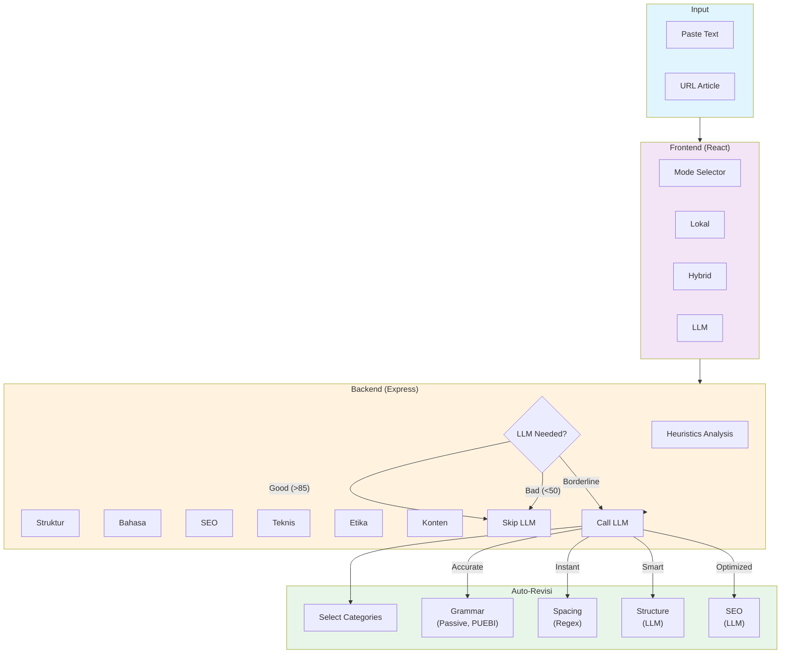

# Article Quality Analyzer

Sistem analisis kualitas artikel berita Bahasa Indonesia dengan fitur **Auto-Revisi** otomatis.

## Fitur Utama

### 1. Analisis Kualitas Artikel
Analisis komprehensif 6 dimensi kualitas:

| Dimensi | Fokus |
|---------|-------|
| **Konten & Sumber** | News value, originalitas, kredibilitas sumber |
| **Struktur/Format** | Judul (5-9 kata), Lead (40-60 + 5W1H), H3, Piramida Terbalik |
| **Bahasa & Gaya** | PUEBI, tono netral, kalimat aktif, keterbacaan |
| **Etika & Legalitas** | Defamation, bias, privasi, perspektif |
| **SEO & Audiens** | Keyword density (1-2%), word count (≥500), fact density |
| **Pemeriksaan Teknis** | Heading hierarchy, spasi, plagiarisme stub |

### 2. Auto-Revisi
Perbaiki artikel secara otomatis dengan 8 kategori:

| Kategori | Tipe | Fungsi |
|----------|------|--------|
| Kalimat Pasif | LLM | Ubah ke kalimat aktif |
| Kalimat Panjang | LLM | Sederhanakan (>25 kata) |
| Kata Formal | LLM | Variasikan kata berulang |
| Ejaan & PUEBI | LLM | Perbaiki ejaan |
| Spasi Ganda | Regex | 2+ spasi → 1 spasi |
| Spasi Akhir | Regex | Hapus trailing whitespace |
| **Struktur & Format** | LLM | Perbaiki judul, lead, heading, piramida |
| **SEO** | LLM | Perbaiki keyword density, paragraf mati |

### 3. Verification Flags
Tandai klaim yang perlu diverifikasi manual:
- 🔴 **Prioritas Tinggi**: Tuduhan tanpa qualifier, risiko defamasi
- 🟡 **Prioritas Sedang**: Kutipan tanpa atribusi, statistik tanpa sumber
- 🔵 **Prioritas Rendah**: Terminologi spesifik, klaim historis

### 4. Sorotan Kalimat
Tampilkan kalimat-kalimat yang perlu perhatian khusus berdasarkan hasil analisis.

### 5. Hook Meter
Penilaian storytelling quality untuk artikel naratif (feature, deep dive, long-form, dll).

**Hanya aktif untuk artikel yang eligible** (bukan straight news, tips, atau data dump).

| Metric | Bobot | Fokus |
|--------|-------|-------|
| Opening Hook | 25% | Kemampuan opening menarik perhatian |
| Character Presence | 20% | Ada orang nyata, kutipan, sudut pandang |
| Narrative Arc | 20% | Konflik → Perkembangan → Resolusi |
| Sensory Details | 15% | Deskripsi spesifik, scenes |
| Emotional Resonance | 20% | Kemampuan bangun emosi pembaca |

---

## Quick Start

```bash
# Install dependencies
npm install

# Start backend (port 4001)
npm run server

# Start frontend (port 5173)
npm run client

# Buka http://localhost:5173
```

### Mode Analisis

| Mode | Biaya | Akurasi | Use Case |
|------|-------|---------|----------|
| **Lokal** | Gratis | ~70% | Development, testing |
| **Hybrid** | Rendah | ~85% | Production (recommended) |
| **LLM Penuh** | Tinggi | ~95% | Keputusan penting |

---

## Arsitektur Sistem



---

## Metodologi

### Standar Jawa Pos (Piramida Terbalik Berlapis)

| Aturan | Standar | Dampak |
|--------|---------|--------|
| Lead | 40-60 kata dengan fakta utama | 44% sitasi AI |
| H3 | Min 2 untuk >400 kata | AI bisa "mendarat" di tengah |
| Fact Density | 1 fakta per 150-200 kata | Paragraf tanpa fakta = "mati" |
| Judul | 5-9 kata + verba aktif | Click-worthy |

---

## Project Structure

```
├── src/
│   └── App.jsx              # Frontend UI
├── server/
│   ├── routes/analyze.js    # Analysis endpoint
│   └── services/
│       ├── heuristics.js    # Local analysis
│       ├── llmEvaluator.js  # LLM + Auto-Revisi
│       └── urlScraper.js    # URL → text
├── Referensi_penulisan/     # Methodology refs
└── vite.config.js          # Proxy config
```

---

## Environment Variables

```bash
PORT=4001
ANTHROPIC_API_KEY=xxx   # Olagon Gateway
MODE=hybrid             # local|hybrid|llm
```

---

## License

MIT
